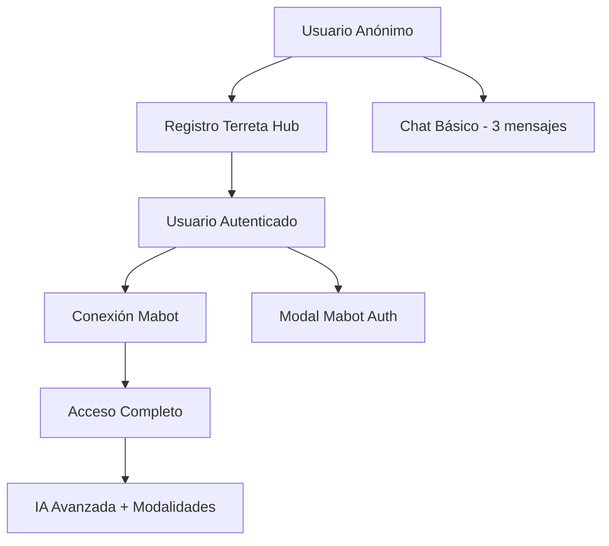

# Integración Chipi + Mabot

## Descripción General

Esta integración conecta Chipi (el asistente virtual de Terreta Hub) con Mabot, una plataforma de IA conversacional avanzada que permite múltiples modalidades de entrada y salida.

## Características Implementadas

### ✅ Modalidades de Entrada
- **Texto**: Chat tradicional por texto
- **Audio**: Grabación de voz en tiempo real y subida de archivos de audio
- **Documentos**: Subida de PDFs, Word, Excel y archivos de texto

### ✅ Modalidades de Salida
- **Texto**: Respuestas inteligentes contextuales

### ✅ Funcionalidades
- **Autenticación dual**: Supabase (Terreta Hub) + Mabot
- **Persistencia de conversaciones**: Las conversaciones se guardan en Supabase
- **Flujo híbrido**: Usuarios anónimos usan bot básico, usuarios autenticados acceden a IA avanzada
- **Transcripción automática**: Los audios se transcriben a texto
- **Análisis de documentos**: Los documentos subidos se procesan e indexan

## Configuración del Bot Chipi

```typescript
// Configuración automática al crear el bot
const botConfig = {
  name: 'Chipi',
  username: 'chipi',
  description: 'Asistente virtual de Terreta Hub...',
  instructions: `Eres Chipi, el asistente virtual de Terreta Hub...`,
  private: false,
  input_modalities: ['text', 'audio', 'document'],
  output_modalities: ['text']
};
```

## Flujo de Usuario

### 1. Usuario No Autenticado
- Acceso limitado al chat básico
- Máximo 3 mensajes antes de solicitar registro
- Respuestas predefinidas sin IA

### 2. Usuario Autenticado (Supabase) pero sin Mabot
- Mensaje para conectar con Mabot
- Modal de autenticación Mabot
- Acceso a funciones básicas

### 3. Usuario Completamente Autenticado (Supabase + Mabot)
- Acceso completo a todas las modalidades
- Respuestas inteligentes de IA
- Persistencia de conversaciones
- Funciones avanzadas (audio, documentos)

## Estructura de Archivos

```
src/integrations/mabot/
├── client.ts              # Cliente API de Mabot
├── README.md              # Esta documentación
src/hooks/
├── useMabot.ts            # Hook personalizado para Mabot
src/components/
├── ChipiInputPanel.tsx    # Panel de entrada multimodal
├── ChipiMessage.tsx       # Componente para mostrar mensajes
src/pages/
├── Chipi.tsx             # Página principal integrada
```

## Uso del Hook useMabot

```typescript
const {
  isAuthenticated,     // Estado de autenticación con Mabot
  isLoading,          // Indica si hay operación en curso
  error,              // Error actual (si existe)
  currentBot,         // Bot actual configurado
  login,              // Función para autenticar
  sendMessage,        // Enviar mensaje de texto
  sendAudio,          // Enviar archivo de audio
  sendDocument,       // Enviar documento
  clearError          // Limpiar errores
} = useMabot();
```

## Tipos de Contenido Soportados

### Audio
- **Formatos**: MP3, WAV, OGG, M4A
- **Tamaño máximo**: 10MB
- **Características**: Transcripción automática a texto

### Documentos
- **Formatos**: PDF, DOC, DOCX, XLS, XLSX, TXT
- **Tamaño máximo**: 10MB
- **Características**: Indexación y análisis de contenido

## Variables de Entorno

```env
# Configuración opcional para Mabot (usa valores por defecto si no se especifica)
VITE_MABOT_API_URL=https://api.mabot.com
```

## Base de Datos

### Tablas Creadas
- `chipi_conversations`: Gestiona las sesiones de chat
- `chipi_messages`: Almacena todos los mensajes intercambiados

### Campos Importantes
```sql
-- chipi_conversations
id, user_id, session_id, mabot_chat_id, created_at, updated_at

-- chipi_messages  
id, conversation_id, role, content_type, content_text, content_metadata, mabot_message_id, created_at
```

## Seguridad

### Row Level Security (RLS)
- Los usuarios solo pueden ver sus propias conversaciones
- Políticas automáticas basadas en `auth.uid()`
- Acceso controlado a través de Supabase Auth

### Autenticación
- **Nivel 1**: Supabase (acceso a la plataforma)
- **Nivel 2**: Mabot (acceso a IA avanzada)
- Tokens gestionados automáticamente con refresh

## Estados y Transiciones



## Próximas Mejoras

- [ ] Soporte para imágenes
- [ ] Respuestas de audio (TTS)
- [ ] Comandos especiales (/buscar, /ayuda)
- [ ] Integración con datos de Terreta Hub
- [ ] Métricas y analytics de uso
- [ ] Exportación de conversaciones

## Troubleshooting

### Error: "No está autenticado"
- Verificar que el usuario esté logueado en Terreta Hub
- Verificar conexión con Mabot

### Error: "Bot no disponible"  
- El bot Chipi se crea automáticamente en el primer uso
- Verificar credenciales de Mabot

### Error: "Archivo muy grande"
- Límite: 10MB por archivo
- Comprimir archivos si es necesario

## Contacto

Para soporte técnico o consultas sobre la integración, contactar al equipo de desarrollo de Terreta Hub. 